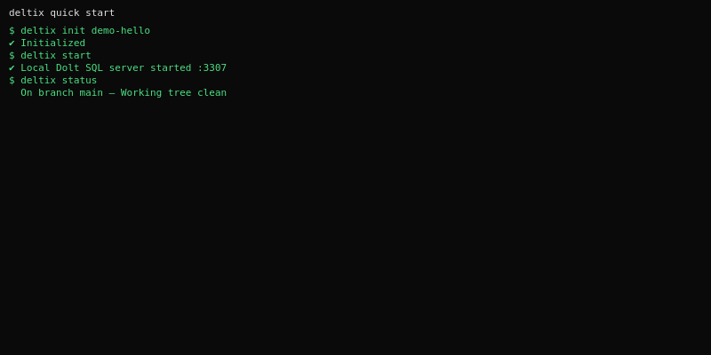
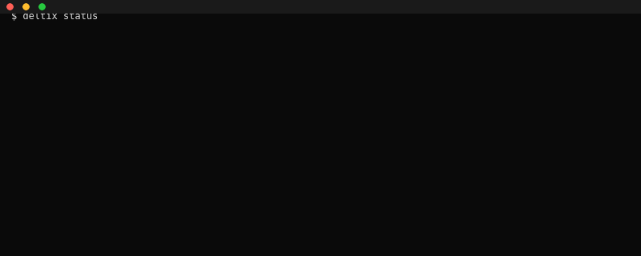
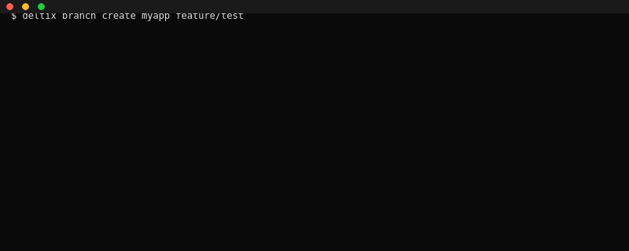
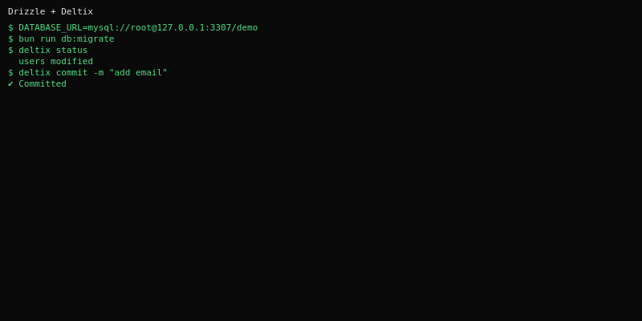
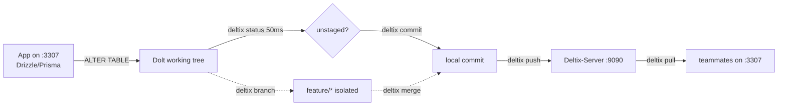

<div align="center">


<br />

[](https://github.com/SammyBytes/Deltix-Client/actions/workflows/ci.yml)
[](https://github.com/SammyBytes/Deltix-Client/releases/latest)
[](./LICENSE)
[](https://github.com/dolthub/dolt)
[](https://bun.sh)

**One binary. One connection string change. Your database, versioned like code.**

`DATABASE_URL=mysql://root@127.0.0.1:3307/repo` — that's the whole migration.

<br />

[Install](#install) • [Quick start](#quick-start) • [Workflow](#workflow) • [Commands](#commands) • [Architecture](#architecture)

</div>

---

<div align="center">

```bash
deltix status        # 50ms — what changed?
deltix commit -m "add email column"
deltix push          # team is up to date
```






<sub>Isolated demos — no sensitive data, repo `demo-hello` in `/tmp`, re-record with `vhs assets/tapes/*.tape`.</sub>

</div>

---

## Why Deltix

<div align="center">

| Without Deltix | With Deltix |
|---|---|
| `mysqldump > dump.sql` → Drive → Slack → `mysql < dump.sql` (overwrites) | `deltix push` → `deltix pull` (merges) |
| No branches. Copy DB to `appdb_test` to try. | `deltix branch create feature` + `deltix checkout` — isolated |
| No diff. `SHOW CREATE TABLE` by eye. | `deltix diff` — row + schema diff |
| No history. Restore backup from 3 days ago. | `deltix log` + `checkout <hash>` |

</div>

---

## Features

<table>
<tr>
<td width="50%">

**Branch & merge — for real**
`feature-emails` with `tags` does not exist on `main` until `merge`. Fast-forward, per-cell conflicts. Validated with Drizzle.

</td>
<td width="50%">

**50ms feedback loop**
`status` via MySQL wire (`mysql2` to `:3307`), not `dolt` spawn. Was 6s on Windows.

</td>
</tr>
<tr>
<td>

**Diff without server**
`deltix diff` shows `dolt diff --stat` locally. No `from/to` needed for working tree.

</td>
<td>

**Git-like, not Git**
`status` → staged vs unstaged (`dolt_status`), `commit -m`, `push`/`pull`, `log -n 5`.

</td>
</tr>
</table>

---

## Install

<table>
<tr>
<th>OS</th>
<th>Command</th>
</tr>
<tr>
<td><b>Linux / macOS</b></td>
<td>

```bash
curl -fsSL https://raw.githubusercontent.com/SammyBytes/Deltix-Client/main/scripts/get-deltix-client.sh | bash
# → ~/.local/bin/deltix
```

</td>
</tr>
<tr>
<td><b>Windows</b></td>
<td>

```powershell
irm https://raw.githubusercontent.com/SammyBytes/Deltix-Client/main/scripts/get-deltix-client.ps1 | iex
# → $HOME\.local\bin\deltix.exe
```

</td>
</tr>
<tr>
<td><b>Any</b></td>
<td>

```bash
# from latest release — no Bun needed
chmod +x deltix-linux-x64 && sudo mv deltix-linux-x64 /usr/local/bin/deltix
deltix version
```

</td>
</tr>
</table>

> First command that needs Dolt downloads the pinned `2.3.1` binary to `~/.deltix/bin/` and verifies SHA-256 — you never install a DB yourself.

---

## Quick start

### A. New project from scratch

```bash
deltix init myapp && deltix start   # Dolt on 127.0.0.1:3307
# .env
DATABASE_URL=mysql://root@127.0.0.1:3307/myapp

# create tables with your ORM — Drizzle, Prisma, SeaORM, whatever
bun run db:migrate
deltix status        # → users new table (unstaged)
deltix commit -m "init schema"
deltix push
```

### B. Adopt an existing MySQL

```bash
deltix init myapp --from mysql://root@127.0.0.1:3306/myapp   # once
# or: deltix import myapp --from mysql://root@127.0.0.1:3306/myapp
deltix push          # ships schema + data

# switch the app — one line
DATABASE_URL=mysql://root@127.0.0.1:3307/myapp  # was :3306
```

> `--continue` skips bad rows (NOT NULL, type coercion), `--schema-only` / `--no-commit` for preview, `--blobs base64|skip` for BLOBs. DSN without password prompts masked.

---

## Workflow — the daily loop

<div align="center">



</div>

```bash
# feature branch — 100% deltix, no dolt needed
deltix branch create myapp feature-emails
deltix checkout feature-emails

# change via ORM
bun run db:migrate

deltix status          # On branch feature-emails / users modified
deltix diff            # 1 Row Added (local)
deltix commit -m "add email column"

deltix checkout main   # isolation: main has 4 users, feature has 5
deltix merge myapp feature-emails   # fast-forward
deltix push
```

---

## Commands

<details>
<summary><b>Setup & auth</b></summary>

| Command | What it does |
|---|---|
| `deltix configure` | One-time setup (server URL, TLS, local port). Saved to `~/.deltix/config.json`. |
| `deltix login <user>` | Masked prompt. `--password=` or `$DELTIX_LOGIN_PASSWORD` for scripts (warns). |
| `deltix logout` / `whoami` | End / show session. |
| `deltix version` | Client + server (`/status` with TLS). |

</details>

<details>
<summary><b>Local — git-like</b></summary>

| Command | What it does |
|---|---|
| `deltix init <repo>` | Bind folder to repo (`.deltix/` + local Dolt repo). |
| `deltix start [<repo>]` | Start `dolt sql-server` on `:3307`. Persists port, fails fast if busy, adopts orphans. |
| `deltix stop` / `status` | Stop / show `running + branch + staged vs unstaged` (wire 50ms). |
| `deltix checkout <branch> [<repo>]` | Global checkout — `stop → dolt checkout → start` so app + CLI share branch. |
| `deltix commit <msg> [tables...]` | `dolt add -A` + `commit` (author = logged-in user). |
| `deltix branch list/create/checkout/delete/current` | Local-first (falls back to local when server has no repo). `branch local` lists both. |
| `deltix diff [<repo> [<from> <to> | <table>]]` | No refs = working-tree `dolt diff --stat` local. With refs = server diff. |
| `deltix merge [<repo>] <src> [target]` | Local merge (fast-forward/conflicts), falls back from server. |
| `deltix log [<repo>]` | Server log. `-n` / `--branch` supported, flags before repo too. |

</details>

<details>
<summary><b>Server / sync</b></summary>

| Command | What it does |
|---|---|
| `deltix repo create/list/get` | Provision / list repos. |
| `deltix push [<repo>]` | Send unpushed commits (schema DDL + CSV rows via `dolt table import`). |
| `deltix pull [<repo>]` | Fetch + merge `origin/main`. `--abort` to abort conflicts. |
| `deltix fetch` | Update `origin/*` without touching branch. |
| `deltix roles` / `sync-prefs` | Per-repo ACL and sync scope. |

</details>

---

## Git integration

`deltix` pairs your data with your code — it **does not replace git and does
not fire git hooks**. Its local versioning lives in Dolt (a database that
versions itself like git), so `deltix commit` / `push` / `pull` do **not** go
through `git`, even when run inside an existing git repo — they are two
independent versioning tracks that coexist in the same working tree.

| Artifact | What it is | Does git see it? |
|---|---|---|
| `.deltix/config.toml` | Project binding (`deltix init`), the analog of `.git/config` | Yes, as an **untracked** file |
| `~/.deltix/` | Local Dolt repos + client config (outside the tree) | No (lives in the home dir) |
| `.dolt/` | Data Dolt repo (outside the working tree) | No |

### The one rule you must respect

When you run `deltix init` inside a code git repo, **add `.deltix/` to your
`.gitignore`**:

```text
# .gitignore
.deltix/
```

Otherwise a plain `git add .` would drag the local Deltix binding into your
code repo by accident (the binding varies per machine and should not travel via
git). Your data — the Dolt repos — already live outside the working tree under
`~/.deltix/`, so only the project-root `.deltix/config.toml` is what you need to
ignore.

### Optional hooks (example)

Since `deltix` does not trigger git hooks, if you want your data pushed
automatically whenever you `git commit` / `git push` code, create the hook
yourself. Example `post-commit`:

```bash
# .git/hooks/post-commit  (create the file and `chmod +x .git/hooks/post-commit`)
deltix push   # runs from the repo dir, resolves the project automatically
```

You can do the same with `post-merge` (refresh data after a `git pull`). For
push automation across all your projects, set a global hooks dir:

```bash
git config --global core.hooksPath ~/.git-hooks
# then write the hook at ~/.git-hooks/post-commit and make it executable
```

> Warning: hooks run on every commit of every project using that
> `core.hooksPath`. A silently failing `deltix push` could slow you down, and a
> `deltix push` when there is nothing to push is wasted work. Prefer a
> per-repo hook, or gate it behind "only run when there is something to send".

---

## Architecture

```
cli/        → parsing + delegation, no logic
  ↓
ports/      → interfaces (DoltSqlPort, LocalRepoPort)
  ↓
core/       → pure functions (table-name, csv)
adapters/   → DoltMysqlAdapter (wire, fast) / DoltCliAdapter (fallback)
contexts/   → stateful orchestration, depends on ports (never adapters directly)
```

No local DB of its own — Dolt is the DB. No Turso. Adding `bun:sqlite` later would be `BunSQLiteAdapter implements DoltSqlPort`, zero context change.

Full rules in [`.github/copilot-instructions.md`](./.github/copilot-instructions.md) — see [docs/ARCHITECTURE.md](./docs/ARCHITECTURE.md) for the one-page version.

---

## Stack & security

| | |
|---|---|
| **Engine** | Dolt `2.3.1` (MySQL wire, branch/merge/diff) |
| **Client** | Bun 1.4 + TypeScript, `consola`, `mysql2`, `zod` — single binary `bun build --compile` |
| **Server** | Bun + Hono REST `:9090`, JWT Ed25519 |
| **Security** | `argv` arrays only (no shell), author sanitised `[A-Za-z0-9_.-]`, TLS trust-on-first-use, creds `0600`, secrets masked |

---

<div align="center">


**MIT** — see [LICENSE](./LICENSE) • [CHANGELOG](./CHANGELOG.md) • [SECURITY](./SECURITY.md)

`DATABASE_URL=:3307` and you are versioned.

</div>
